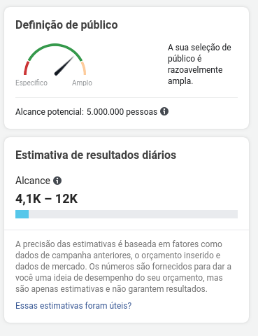
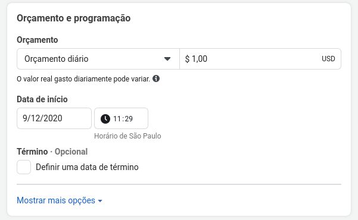

# [Spike] Estimativa de Alcance

## Table of Contents

- [Sobre](#about)
- [Funcionamento do Gerenciador](#getting_started)
- [Show Me The Code](#usage)

## Sobre <a name = "about"></a>

O gerenciador do Facebook possui uma feature de estimativa de alcance, onde ao preencher o publico alvo e o orçamento de sua campanha, ele te traz de forma dinâmica um valor estimado do alcance que essa campanha terá.



## Funcionamento do Gerenciador <a name = "getting_started"></a>

Ao alterarmos o publico alvo, o gerenciador realiza uma nova requisição a sua API, para receber as estimativas de alcance do mesmo, como no exemplo abaixo **(Foi feito o decode e identado de forma a facilitar o entendimento)**.
### Requisição
```
curl--location--requestGET'https://graph.facebook.com/v7.0/<account_id>/delivery_estimate?access_token=<access_token>&
__cppo=1&
__activeScenarioIDs=[]&
__activeScenarios=[]&
_app=ADS_MANAGER&
_reqName=adaccount/delivery_estimate&
_reqSrc=adsDeliveryEstimateDataLoaderLoadDeliveryEstimate&
_sessionID=5f9dfaa77cf2a7a7&
attribution_spec=[{"event_type":"CLICK_THROUGH","window_days":1}]&
bid_strategy=LOWEST_COST_WITHOUT_CAP&
currency=USD&
include_headers=false&
is_cbo_enabled=false&
is_dtaas=false&
locale=pt_BR&
method=get&
optimization_goal=REACH&
pretty=0&
promoted_object={"page_id":"2049377258664947"}&
send_long_term_prediction_shadow_request=true&
skip_bid_suggestion=true&
suppress_http_code=1&
targeting_spec={"geo_locations":{"countries":["BR"],"location_types":["home","recent"]},"age_min":13,"age_max":16,"publisher_platforms":["facebook","instagram","audience_network"],"facebook_positions":["feed","instant_article","instream_video","video_feeds","marketplace","story","search"],"instagram_positions":["stream","story","explore"],"messenger_positions":[],"device_platforms":["mobile","desktop"],"audience_network_positions":["classic","instream_video"],"excluded_publisher_list_ids":[],"user_device":[],"excluded_user_device":[],"user_os":[],"wireless_carrier":[],"brand_safety_content_filter_levels":["FACEBOOK_STANDARD","AN_STANDARD"],"excluded_brand_safety_content_types":[]}&
xref=f13797fcbb610e8'\--header'authority:graph.facebook.com'\--header'user-agent:Mozilla/5.0(X11;Linuxx86_64)AppleWebKit/537.36(KHTML,likeGecko)Chrome/86.0.4240.193Safari/537.36'\--header'content-type:application/x-www-form-urlencoded'\--header'accept:*/*'\--header'origin:https://www.facebook.com'\--header'sec-fetch-site:same-site'\--header'sec-fetch-mode:cors'\--header'sec-fetch-dest:empty'\--header'referer:https://www.facebook.com/'\--header'accept-language:en-US,en;q=0.9'
```

Ao fazer o decode dessa requisição, consegui identificar inumeros campos para manipularmos essa requisição ao nosso favor:
- currency: podemos estipular o tipo de moeda com a qual estamos trabalhando
- optimization_goal: passamos a forma pela qual queremos otimizar nossa estimativa, no caso estou usando REACH por conta de estimar o alcance dessa campanha
- attribution_spec: um json onde é passado publico alvo, exemplo:
```json
{
    "geo_locations": {
        "countries": [
            "BR"
        ],
        "location_types": [
            "home",
            "recent"
        ]
    },
    "age_min": 13,
    "age_max": 16,
    "publisher_platforms": [
        "facebook",
        "instagram",
        "audience_network"
    ],
    "facebook_positions": [
        "feed",
        "instant_article",
        "instream_video",
        "video_feeds",
        "marketplace",
        "story",
        "search"
    ],
    "instagram_positions": [
        "stream",
        "story",
        "explore"
    ],
    "messenger_positions": [],
    "device_platforms": [
        "mobile",
        "desktop"
    ],
    "audience_network_positions": [
        "classic",
        "instream_video"
    ],
    "excluded_publisher_list_ids": [],
    "user_device": [],
    "excluded_user_device": [],
    "user_os": [],
    "wireless_carrier": [],
    "brand_safety_content_filter_levels": [
        "FACEBOOK_STANDARD",
        "AN_STANDARD"
    ],
    "excluded_brand_safety_content_types": []
}
```
### Resposta da Requisição

Ao avaliar o retorno recebemos o seguinte Json:

```json
{
  "daily_outcomes_curve": [
    {
      "bid": 0,
      "spend": 0,
      "reach": 0,
      "impressions": 0,
      "actions": 0,
      "predicted_errors_conversions": 0,
      "predicted_errors_reach": 0,
      "reach_lower_bound": 0,
      "reach_upper_bound": 0,
      "actions_lower_bound": 0,
      "actions_upper_bound": 0
    },
    {
      "bid": 10,
      "spend": 179092,
      "reach": 12527617.727833,
      "impressions": 3577766.6271769,
      "actions": 19129.457805217,
      "predicted_errors_conversions": 1.7,
      "predicted_errors_reach": 1.7,
      "reach_lower_bound": 7369186.8987256,
      "reach_upper_bound": 21296950.137317,
      "actions_lower_bound": 11252.622238363,
      "actions_upper_bound": 32520.078268869
    },
    {
      "bid": 50,
      "spend": 279646,
      "reach": 13776655.434018,
      "impressions": 4195100.8133238,
      "actions": 20425.216203286,
      "predicted_errors_conversions": 1.7,
      "predicted_errors_reach": 1.7,
      "reach_lower_bound": 8103914.961187,
      "reach_upper_bound": 23420314.237831,
      "actions_lower_bound": 12014.833060756,
      "actions_upper_bound": 34722.867545586
    },
    {
      "bid": 100,
      "spend": 308960,
      "reach": 13949439.616444,
      "impressions": 4303187.6036971,
      "actions": 20553.896411632,
      "predicted_errors_conversions": 1.7,
      "predicted_errors_reach": 1.7,
      "reach_lower_bound": 8205552.7155555,
      "reach_upper_bound": 23714047.347955,
      "actions_lower_bound": 12090.52730096,
      "actions_upper_bound": 34941.623899775
    },
    {
      "bid": 500,
      "spend": 349193,
      "reach": 14074680.050859,
      "impressions": 4386537.2509561,
      "actions": 20621.158889327,
      "predicted_errors_conversions": 1.7,
      "predicted_errors_reach": 1.7,
      "reach_lower_bound": 8279223.5593288,
      "reach_upper_bound": 23926956.08646,
      "actions_lower_bound": 12130.09346431,
      "actions_upper_bound": 35055.970111857
    },
    {
      "bid": 1000,
      "spend": 360710,
      "reach": 14086218.231493,
      "impressions": 4395505.6850926,
      "actions": 20626.553708864,
      "predicted_errors_conversions": 1.7,
      "predicted_errors_reach": 1.7,
      "reach_lower_bound": 8286010.7244077,
      "reach_upper_bound": 23946570.993538,
      "actions_lower_bound": 12133.266887567,
      "actions_upper_bound": 35065.141305068
    },
    {
      "bid": 1500,
      "spend": 365921,
      "reach": 14089478.183429,
      "impressions": 4398168.881297,
      "actions": 20627.659699701,
      "predicted_errors_conversions": 1.7,
      "predicted_errors_reach": 1.7,
      "reach_lower_bound": 8287928.3431933,
      "reach_upper_bound": 23952112.911829,
      "actions_lower_bound": 12133.917470412,
      "actions_upper_bound": 35067.021489491
    },
    {
      "bid": 2000,
      "spend": 369422,
      "reach": 14091711.476248,
      "impressions": 4399862.7141316,
      "actions": 20628.075717794,
      "predicted_errors_conversions": 1.7,
      "predicted_errors_reach": 1.7,
      "reach_lower_bound": 8289242.0448515,
      "reach_upper_bound": 23955909.509621,
      "actions_lower_bound": 12134.162186938,
      "actions_upper_bound": 35067.72872025
    },
    {
      "bid": 3000,
      "spend": 374610,
      "reach": 14093587.658745,
      "impressions": 4401544.7237154,
      "actions": 20628.588274851,
      "predicted_errors_conversions": 1.7,
      "predicted_errors_reach": 1.7,
      "reach_lower_bound": 8290345.6816145,
      "reach_upper_bound": 23959099.019866,
      "actions_lower_bound": 12134.463691089,
      "actions_upper_bound": 35068.600067246
    },
    {
      "bid": 4000,
      "spend": 376389,
      "reach": 14094395.891158,
      "impressions": 4402305.1422984,
      "actions": 20628.694946886,
      "predicted_errors_conversions": 1.7,
      "predicted_errors_reach": 1.7,
      "reach_lower_bound": 8290821.1124458,
      "reach_upper_bound": 23960473.014968,
      "actions_lower_bound": 12134.526439345,
      "actions_upper_bound": 35068.781409706
    },
    {
      "bid": 5000,
      "spend": 377982,
      "reach": 14094867.280768,
      "impressions": 4402811.2608358,
      "actions": 20628.812694093,
      "predicted_errors_conversions": 1.7,
      "predicted_errors_reach": 1.7,
      "reach_lower_bound": 8291098.4004516,
      "reach_upper_bound": 23961274.377305,
      "actions_lower_bound": 12134.595702408,
      "actions_upper_bound": 35068.981579958
    },
    {
      "bid": 6000,
      "spend": 378746,
      "reach": 14095255.465848,
      "impressions": 4403155.1323642,
      "actions": 20628.842098118,
      "predicted_errors_conversions": 1.7,
      "predicted_errors_reach": 1.7,
      "reach_lower_bound": 8291326.7446162,
      "reach_upper_bound": 23961934.291941,
      "actions_lower_bound": 12134.612998893,
      "actions_upper_bound": 35069.031566801
    },
    {
      "bid": 7000,
      "spend": 379850,
      "reach": 14095598.283887,
      "impressions": 4403385.3866264,
      "actions": 20628.876026393,
      "predicted_errors_conversions": 1.7,
      "predicted_errors_reach": 1.7,
      "reach_lower_bound": 8291528.4022867,
      "reach_upper_bound": 23962517.082608,
      "actions_lower_bound": 12134.632956702,
      "actions_upper_bound": 35069.089244868
    },
    {
      "bid": 8000,
      "spend": 381056,
      "reach": 14095794.840053,
      "impressions": 4403590.0256354,
      "actions": 20628.907862945,
      "predicted_errors_conversions": 1.7,
      "predicted_errors_reach": 1.7,
      "reach_lower_bound": 8291644.0235607,
      "reach_upper_bound": 23962851.228091,
      "actions_lower_bound": 12134.651684085,
      "actions_upper_bound": 35069.143367007
    },
    {
      "bid": 9000,
      "spend": 382008,
      "reach": 14095899.488938,
      "impressions": 4403713.6643262,
      "actions": 20628.930753354,
      "predicted_errors_conversions": 1.7,
      "predicted_errors_reach": 1.7,
      "reach_lower_bound": 8291705.5817285,
      "reach_upper_bound": 23963029.131195,
      "actions_lower_bound": 12134.665149032,
      "actions_upper_bound": 35069.182280702
    },
    {
      "bid": 10000,
      "spend": 385561,
      "reach": 14095933.508275,
      "impressions": 4403845.0560663,
      "actions": 20629.006412072,
      "predicted_errors_conversions": 1.7,
      "predicted_errors_reach": 1.7,
      "reach_lower_bound": 8291725.5931028,
      "reach_upper_bound": 23963086.964067,
      "actions_lower_bound": 12134.70965416,
      "actions_upper_bound": 35069.310900523
    }
  ],
  "estimate_dau": 3175788,
  "estimate_mau": 5000000,
  "estimate_ready": true,
  "is_curve_eligible": false,
  "trace_id": "d1e0eb366fb0d3812b330025a5d43fdc",
  "outcomes_curve_by_day": ["array omitido, por ser grande demais e inutilizado"],
  "long_term_prediction_trace_id": "a212cfe8d9dc0f3e2ab95e1ec564109d",
  "targeting_status": "none"
}

```
### Conclusão

Ao avaliar essa resposta, identifiquei alguns campos uteis:
- *daily_outcomes_curve*:  **Um array de estimativas com os seguintes campos uteis:**
    - *spend*:  **Valor em centavos gasto**
    - *reach_lower_bound*: **Alcance estimado minimo**
    - *reach_upper_bound*: **Alcance estimado maximo**
- *estimate_dau*: **estimativa de usuarios ativos diaria(DAU: Daily Active Users)**
- *estimate_mau*: **estimativa de usuarios ativos mensal(MAU: Monthly Active Users)**


Com essas informações o gerenciador enquadra o valor preenchido em Orçamento, como no exemplo abaixo:



Entre os valores do vetor *daily_outcomes_curve*, aferindo indice a indice, se o valor preenchido coincide com o campo *spend* de cada indice, caso não encontre nenhum igual, ele ira calcular uma media entre dois pontos desse vetor, sendo os dois com valor *spend* mais proximos ao valor preenchido na imagem anterior. 
## Show Me the Code <a name = "usage"></a>

Separei em duas functions, que recebem os mesmos parametros, o primeiro seria o valor transformado para centavos preenchido em Orçamento, e o segundo o vetor *daily_outcomes_curve* recebido na resposta da requisição, tendo como retorno um objeto onde lower se trata da estimativa pessimista e upper a otimista.
```javascript
function find_values(daily_cost, daily_outcomes_curve) {
    valor = find_closests(daily_cost, daily_outcomes_curve)
    //Aumento de Alcance por centavo aplicado
    value_upper_bound_per_cent = (valor.higher.reach_upper_bound - valor.lower.reach_upper_bound) / (valor.higher.spend - valor.lower.spend)
    value_lower_bound_per_cent = (valor.higher.reach_lower_bound - valor.lower.reach_lower_bound) / (valor.higher.spend - valor.lower.spend)
    //Diferenca em centavos do daily_cost para o menor valor
    dif = daily_cost - valor.lower.spend
    if (dif == 0)
        //Caso nao tenha diferenca, retorno a estimativa exata, pois ja achamos o ponto no vetor sendo ele o lower
        return valor.lower

    //Caso contrario, calculo os valores,
    // multiplicando o Alcance por centavo pela diferenca,
    // e incremento a diferenca nos valores de upper e lower, da estimativa mais baixa
    return {
        upper: valor.lower.reach_upper_bound+(dif * value_upper_bound_per_cent),
        lower: valor.lower.reach_lower_bound+(dif * value_lower_bound_per_cent)
    }
}

function find_closests(daily_cost, daily_outcomes_curve) {
    //Acha o valor menor mais proximo do daily_cost ou igual ao mesmo
    closest_lowest = daily_outcomes_curve.slice().sort((a, b) => {a.spend - b.spend}).reduce((prev, curr) => {
        return  prev.spend == daily_cost ? prev :
                curr.spend == daily_cost ? curr :
                prev.spend < daily_cost && curr.spend > daily_cost ? prev :
                curr.spend < daily_cost ? curr : prev;
    });

    //Acha o valor maior mais proximo do daily_cost ou igual ao mesmo
    closest_higher = daily_outcomes_curve.slice().sort((a,b) => {(a.spend - b.spend)}).reverse().reduce((prev, curr) => {
        return  prev.spend == daily_cost ? prev :
                curr.spend == daily_cost ? curr :
                prev.spend > daily_cost && curr.spend < daily_cost ? prev :
                    curr.spend > daily_cost ? curr : prev;
    });
    //Retorno os dois valores
    return {
        lower : closest_lowest,
        higher : closest_higher
    }
}
```